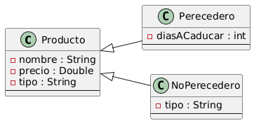

  ## Enunciado: Sistema de gestión de productos

  **Tipo de actividad:** Práctica formativa autogestionada con autocorrección  
  **Objetivo:** Crear un diagrama UML

  ---

  ### Descripción

  Trabajamos en una tienda en línea y nos han pedido desarrollar un sistema de gestión de productos.

  El objetivo es administrar diferentes tipos de productos y calcular el precio total de venta de cada uno.

  Los productos en el sistema tienen **tres atributos comunes**:  
  - `nombre`  
  - `precio`  
  - `tipo`  

  Existen **dos tipos específicos de productos**:
  - **Perecederos:**  
    - Atributo adicional: `días a caducar` (indica cuántos días faltan para que caduque)
  - **No perecederos:**  
    - Atributo adicional: `tipo` (especifica la categoría a la que pertenece)

  ---

  ### ¿Qué te proponemos realizar?

  - Crear el diagrama UML acorde al enunciado.
  - Codificar las clases detectadas.

  > En la próxima semana le daremos funcionalidad al sistema. ¡Estemos preparados con nuestra base!

  ## Diagrama UML de "Producto"

  