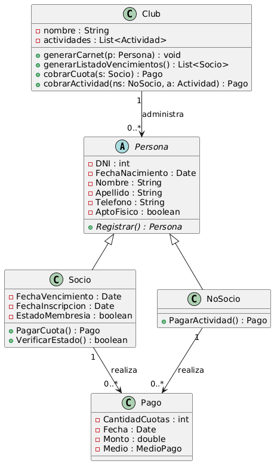

## Tarea 1: Analizar el funcionamiento del club deportivo

**Tipo:** Práctica para el proyecto integrador.  
**Formato:** Documento de texto propio del/la estudiante.  
**Objetivo:** Realizar el análisis preliminar del funcionamiento del club deportivo.

---

### Para resolver la tarea te proponemos:

- Leer el enunciado del funcionamiento del club deportivo.
- Identificar clases y atributos.
- Documentar el análisis para tenerlo a disposición en las próximas semanas.

---

### Enunciado: Funcionamiento del Club Deportivo

La empresa administra un **club deportivo** que tiene distintos tipos de actividades destinadas a **socios y no socios**. Algunas características de cómo se organiza el club son:  
- Socios  
- Cuota  
- Inscripción  
- Plantel

Vencido el periodo de pago, automáticamente el socio no puede realizar actividades. Para retomar, debe pagar la cuota, y el plazo de pago comienza a correr a partir del día siguiente al vencimiento de la cuota.

Cada **profesor**, además de dictar su clase en los horarios asignados, controla las actividades del salón general (musculación y aparatos), y confecciona las rutinas para sus alumnos. Los profesores firman una planilla de asistencia a la llegada al club y el cobro de su sueldo es mensual, el último día hábil del mes.

---

### Se desea realizar un sistema que permita administrar de manera eficiente el servicio prestado a fin de controlar:

- Registro de los socios y de los no socios.
- Entrega de carnet y cobro de cuota mensual o diaria.
- Listado diario de los socios que en la fecha les vence la cuota.

---

**¡Manos a la obra!**

*Diagrama de clases propuesto FASE1*
 

