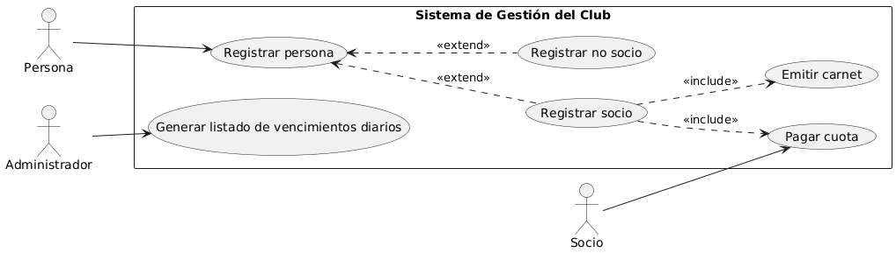

# Fase 3 : Análisis orgánico
## Analizar y crear las plantillas de caso de uso del sistema

*Diagrama de casos de uso, propuesto FASE3*
 

## Plantillas de casos de uso :

[DOCUMENTO](https://docs.google.com/document/d/1ZnGVUTRVnBdTemNCy8GlPXTsq5Dwsniyfk5je8CUOo4/edit?tab=t.i9ei95jhr9th)
